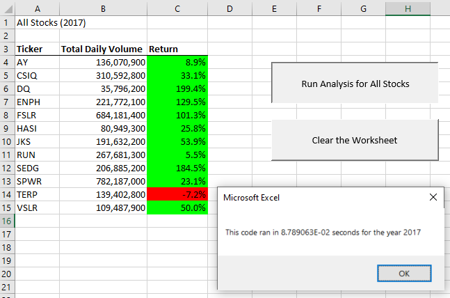

# VBA of Wall Street

## Overview of Project

This project utilized VBA to assist a client, Steve, in analyzing stock data for his parents. The client's parents were interested in green energy and were planning to invest their money into DAQO New Energy Corporation with stock ticker DQ. To provide financial guidance to his parents, the client created an Excel file to look into DAQO's stock performance for 2017 and 2018, but the client also wanted to investigate other stocks where his parents might see better returns. The client needed an analyst to develop VBA code to efficiently perform the analysis on multiple stocks.

### Purpose

The overall purpose of this project was to use VBA in Microsoft Excel to gain insight into stock trends for twelve different companies over the course of 2017 and 2018. Students improved their VBA skills while performing analysis to assist a client in providing financial advice based on historical data.

## Results

VBA code was developed to analyze the total volume and return for 12 stocks in 2017 and 2018. Since the client may want to investigate stocks in various years for future analysis, an input box was added to prompt the user for the year under investigation. The input box along with its corresponding VBA code are shown in Fig. 1.

*Figure 1. Input box and corresponding VBA code*

Notice the value entered into the input box is assigned to the variable yearValue. This variable is used in multiple locations throughout the VBA script to access the appropriate worksheet containing raw stock data and create a heading for the analysis worksheet.

An array of tickers was also created to hold the stock ticker symbols for the associated stocks. The elements of this array are accessed throughout the code using a tickerIndex, and each ticker index is used to calculate total volume and return from the raw data. The tickers array declaration and initialization are shown in Fig. 2.

*Figure 2. Tickers array declaration and initialization*

One of the purposes of this challenge was to refactor code written during the weekly assignment. Part of the refactoring process involved creating arrays for tickerVolumes, tickerStartingPrices, and tickerEndingPrices. This allowed for the values of interest to be stored in arrays eliminating the need for a nested for-loop that looped across the tickers as well as the entire set of raw data. This significantly sped up the execution of this script, which could be valuable if the client wanted to analyze thousands of stocks over multiple years.

In order to access the tickers array and write data to the output arrays, a tickerIndex variable was created that takes on values from 0 to 11 and is used to access the appropriate element in each array. Also note that the tickerVolumes array was initialized to zero. The array declarations, declaration and initialization of the tickerIndex, and the initializaion of the tickerVolumes array are shown in Fig. 3.

*Figure 3. Declarations for tickerIndex and output arrays as well as initialization of totalVolumes array*

For reference, the for-loop used to calculate the ticker volumes and find the starting and ending prices is shown in Fig. 4. This figure also illustrates the use of the tickerIndex variable. Note that the tickerIndex variable is initially set to zero and increments by one every time a different ticker is identified.

*Figure 4. For-loop to find total volume as well as starting and ending prices*

The VBA code developed in this challenge was specifically used to investigate the performance of twelve different stocks in 2017 and 2018. The results for each year are described below. Also note that a timer was incorporated to track the execution speed of the code developed for the weekly assignment against the refactored code. Additionally, buttons were added to run the VBA script and clear the worksheet making the Excel file more user friendly.

### 2017 Stock Data Analysis

The returns were mostly positive for the twelve stocks under investigation in 2017 ranging from -7.2% for TERP to over 199% for DQ. The total daily volumes ranged from nearly 36,000,000 for DQ to over 782,000,000 for SPWR. It is interesting to note that although DQ saw the lowest total daily volume, it did see the highest return.

*Figure 5. 2017 stock performance and refactored code execution speed*

Also note that the code executed in roughly 0.088 seconds for the refactored code. This is significantly faster than the 0.58 seconds that were required for the original code as shown in Fig. 6. Note, however, that the total daily volumes and returns were identical for Figs. 5 and 6 as they should be.

*Figure 6. 2017 stock performance and original code execution speed*

### 2018 Stock Data Analysis

The returns for the twelve stocks under investigation were overall much worse in 2018 than they were in 2017 as shown in Fig. 7. All but two stocks exhibited negative returns in 2018. The total returns ranged from -62.6% for DQ to 84% for RUN. Seven stocks saw an increase in total daily volume in 2018 compared to 2017. The total daily volume ranged from over 83,000,000 for AY to over 607,000,000 for ENPH. It is interesting to note that the total daily volume for DQ increased by over 70,000,000 from 2017 to 2018, but the stock saw a -62.6% return in 2018. This could indicate a correction in the stock price of the company in 2018.

*Figure 7. 2018 stock performance and refactored code execution speed*

Similar to the 2017 analysis, the refactored code ran considerably faster for the 2018 analysis. The refactored code ran in roughly 0.09 seconds compared to roughly 0.58 seconds for the original code as shown in Fig. 9. Note, however, that the total daily volumes and returns were identical for Figs. 8 and 9 as they should be.

*Figure 8. 2018 stock performance and original code execution speed*

## Summary

1. Discuss the advantages and disadvantages of refactoring code.
    - Advantages
        - One of the primary advantages of refactoring code is the improvement in execution speed of the code. This can be particularly advantageous with very large amounts of data. Even if the code correctly performs its intended analysis, clients may not be pleased if the code takes excessive amounts of time to execute.
        - Another advantage of refactoring code is that it can eliminate nested loops and reduce the total line count. This can decrease the chances for errors and make the code easier to modify and/or troubleshoot in future work.
    - Disadvantages
        - One of the disadvantages of refactoring is that it can take time to go through the process. In many cases, projects have tight deadlines, and developers may be in a rush to simply develop functioning code. It could be difficult to find the extra time to go back and refactor the code unless a problem arises.
        - Another potential disadvantage of refactoring code, is that it introduces the chance to make errors. Although refactored code can be easier for future modification/troubleshooting, the process of refactoring working code introduces the chance for errors. Therefore, it is important to always maintain a working copy of the code and save often.
2. How do the advantages and disadvantages discussed above apply to refactoring the original VBA script?
    - The advantages discussed above directly apply to the code that was refactored for this challenge. The execution speed improved by more than 84% for the refactored code compared to the original code. Additionally, the nested for-loop used in the original code was eliminated for the refactored code. This was accomplished through the use of output arrays and the tickerIndex variable used to access the elements of those arrays. In the case of this challenge, the disadvantages were not readily apparent as the refactoring process was used as a tool to help students learn VBA scripting. However, if the original code had been developed outside of this context, the disadvantages could have presented themsleves as additional challenges. For instance, using and properly incrementing the tickerIndex variable could have been a bit of a challenge for those with limited coding experience.
